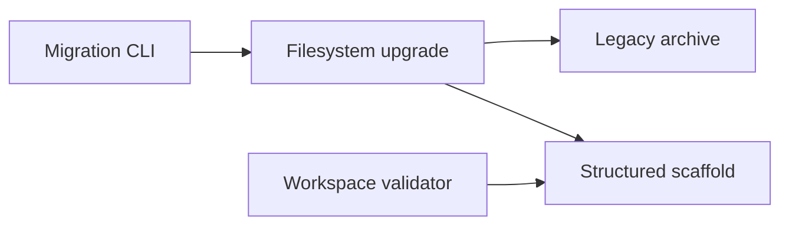
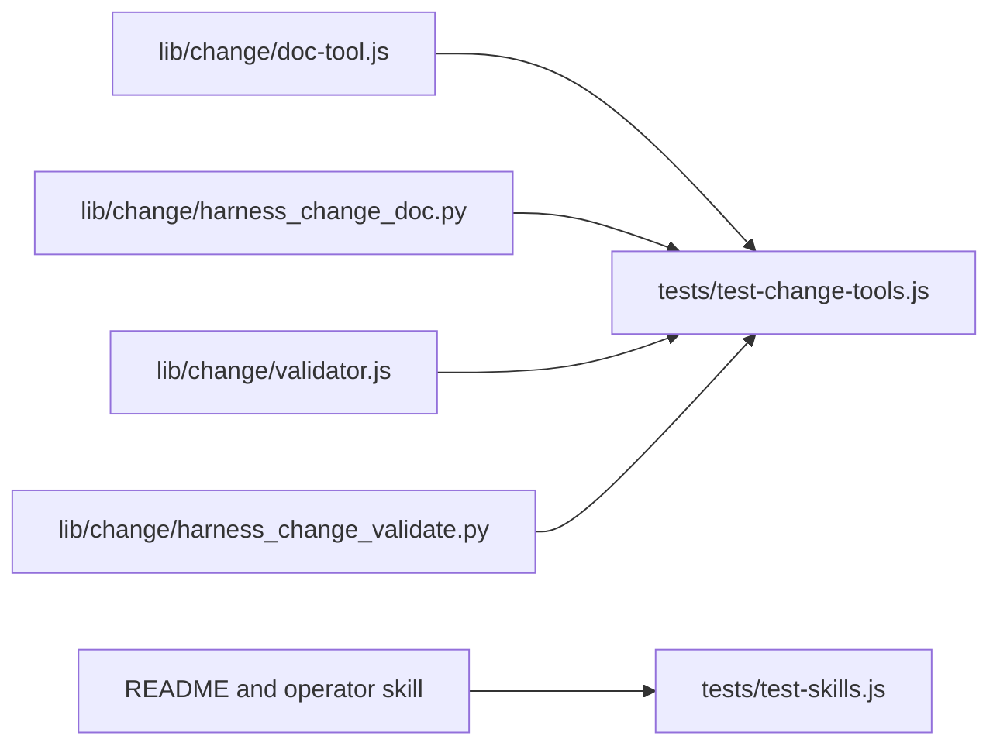

# Code Topology

## Subsystem Topology

Use this section for capability or runtime boundaries: inputs, outputs,
lifecycle, external dependencies, and failure boundaries.

## Module Topology

Use this section for code organization boundaries: directories, packages,
modules, and dependency direction.

## Dependency Rules

| Rule | Allowed | Forbidden | Rationale |
|---|---|---|---|
| Migration writes | archive, scaffold, source cleanup | persistent transaction state or locks | rerun is the recovery mechanism |
| Historical content | byte-preserving archive | semantic translation | preserve meaning |
| Validation | current layout and top-level legacy warnings | bootstrap or transaction authorization | validators do not own history |
| Language parity | same outcomes and output shape | separate protocol behavior | prevent client drift |
| Concurrency | one writer per change migration | concurrent migration/edit guarantee | avoid lock infrastructure |

## Source Anchors

Use `relative/path:Symbol` when possible. For symbol-less config or docs, use
`relative/path` plus the smallest stable heading, key, or field name.

| Boundary | Source anchor | Notes |
|---|---|---|
| Node command | `lib/change/doc-tool.js:commandMigrate` | canonical package CLI |
| Python command | `lib/change/harness_change_doc.py:command_migrate` | portable mirror |
| Node validator | `lib/change/validator.js:validateChange` | remove transaction/bootstrap checks |
| Python validator | `lib/change/harness_change_validate.py:validate_change` | mirror validator behavior |
| Contract tests | `tests/test-change-tools.js` | old/new/conflict/resume/parity |
| Public command policy | `lib/change/js-policy.js` and Python policy output | remove digest syntax |
| Python parser | `lib/change/harness_change_doc.py` argument parser | remove digest option |
| User guidance | `README.md`, `README_CN.md`, `skills/change/change-workspace-operator/SKILL.md` | direct apply and rerun |
