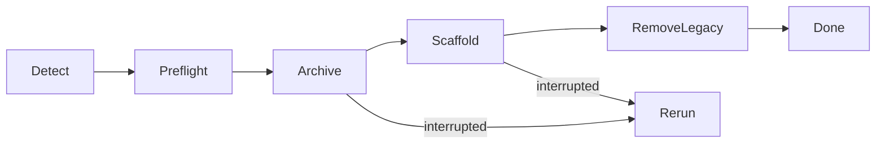
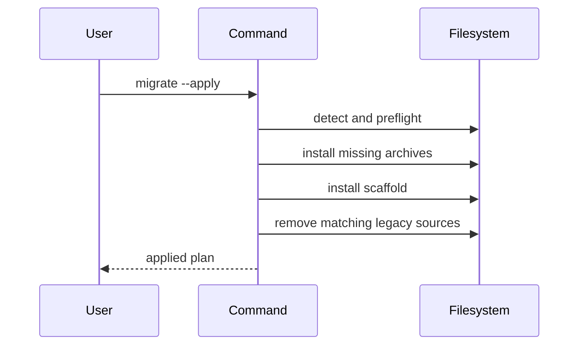
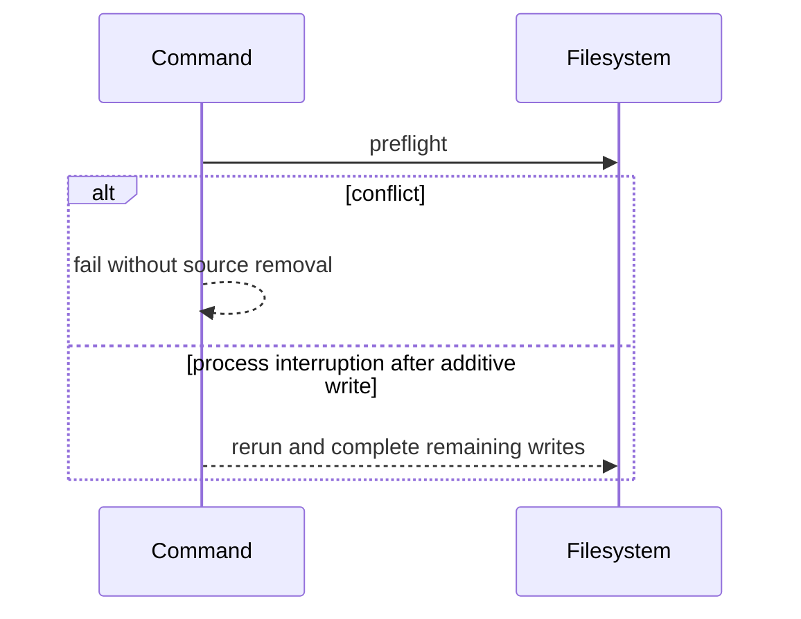

# Runtime Flow

## N/A Usage

If lifecycle, sequence, state, failure, rollback, concurrency, migration, and
idempotency behavior are not material to this change, write `N/A - <reason>`
under the sections below instead of leaving diagrams or tables blank.

## Object Lifecycle

## Main Sequence

## Failure and Rollback Sequence

## State Transitions

| State | Entered by | Exits to | Invariants |
|---|---|---|---|
| legacy | top-level legacy input exists | partial or structured | source remains until archive matches |
| partial | archive or scaffold partly exists | structured | rerun never overwrites conflicts |
| structured | archive exists and legacy input removed | structured | rerun is idempotent |
| concurrent mutation | unsupported | caller retries after exclusive access | command provides no lock guarantee |

## Traceability

| Flow or state | Requirement / source fact | Source anchor | Verification plan |
|---|---|---|---|
| conflict preflight | no overwrite | migration helper | conflicting archive fixture |
| partial resume | rerun recovery | migration helper | archive-only and partial scaffold fixture |
| structured idempotence | repeat-safe | command | repeated apply fixture |
