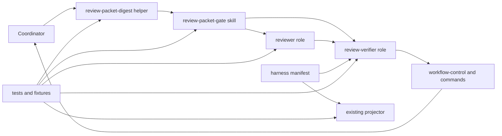
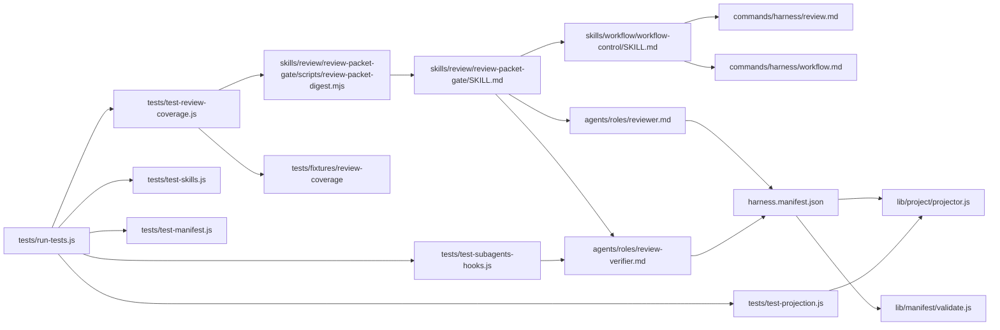

# Code Topology

## Subsystem Topology

The helper is a support boundary, not a workflow owner. It computes target and
packet identities. The skill explains packet fields and gates. Roles consume or
produce packets. Workflow text selects an order and the coordinator alone
composes the overall decision.

## Module Topology

## Dependency Rules

| Rule | Allowed | Forbidden | Rationale |
|---|---|---|---|
| Packet protocol stays in the existing review skill. | Extend `review-packet-gate` and reference its helper. | A second review-coverage skill or top-level process root. | Existing packet/gate owner already composes this context. |
| Helper scope stays identity-only. | Read Git/artifact state, typed path options, opaque declaration bytes, and packet bytes; write stdout only. | Ledger/declaration parsing, unit discovery, RuleRef inference, packet persistence, or gate decisions. | Reproducibility needs a small deterministic seam, not a new analyzer. |
| Role authority stays asymmetric. | `reviewer` reports correctness and conditional ledger; `review-verifier` inventories or compares deep coverage. | Verifier edits, overall-gate ownership, or routine full second review. | Keeps independence and prevents duplicated workflow authority. |
| Existing generic projection is reused. | Register the new role in manifest and assert all clients render it. | Client-specific verifier bodies or changes to `renderAgent` without a concrete compatibility gap. | Static projection already preserves canonical source role text. |
| Tests separate deterministic from model behavior. | Unit-test helper behavior, static contracts, fixtures, manifest, and projections; run a recorded fresh-agent evaluation. | Treat fixture text assertions as proof that all models discover every omission. | The frozen assurance boundary forbids that overclaim. |
| No new serialized ledger contract is added. | Markdown tables and fixture documents. | JSON schema, parser, persistent ledger database, or generic record store. | V1 remains narrowly scoped and human-readable. |

## Source Anchors

Use `relative/path:Symbol` when possible. For symbol-less config or docs, use
`relative/path` plus the smallest stable heading, key, or field name.

| Boundary | Source anchor | Notes |
|---|---|---|
| Target and packet identity | `skills/review/review-packet-gate/scripts/review-packet-digest.mjs` | New Node 20 read-only helper. It is packaged with the skill and has no manifest entry of its own. |
| Packet, profile, ledger, gaps, and gate wording | `skills/review/review-packet-gate/SKILL.md:## Packet` | Extend the current packet owner; reference helper invocation and output shape. |
| Correctness reviewer | `agents/roles/reviewer.md:## Output Packet` | Add coverage-mode conditional output without weakening findings-first ordering. |
| Deep coverage verifier | `agents/roles/review-verifier.md` | New specialist role with inventory and comparison modes, explicit read-only authority, and no overall-gate authority. |
| Mode routing and gate order | `skills/workflow/workflow-control/SKILL.md:## Loop` | Add quick/standard/deep routing and four-gate composition rules. |
| Review command routing | `commands/harness/review.md:## Required Behavior` | Name coverage-mode packet preparation and deep verifier dispatch. |
| Workflow command routing | `commands/harness/workflow.md:## Required Behavior` | Keep state-root resolution and add review coverage before implementation verification. |
| Role registration | `harness.manifest.json:assets.agents` | Add one `review-verifier` specialist with existing four clients. |
| Projection reuse | `lib/project/projector.js:renderAgent` | No functional change planned; existing rendering is a compatibility dependency. |
| Manifest validation reuse | `lib/manifest/validate.js:validateAgents` | No functional change planned; verify new role passes generic checks. |
| Helper and fixture checks | `tests/test-review-coverage.js` | New focused test file registered by `tests/run-tests.js`. |
| Role contract/projection checks | `tests/test-subagents-hooks.js:run`, `tests/test-projection.js:run` | Extend existing role and all-client projection patterns. |
| Skill and routing checks | `tests/test-skills.js:run` | Extend current source-text contract assertions. |
| Manifest count and registration | `tests/test-manifest.js:run` | Update expected agent count and assert registration. |
