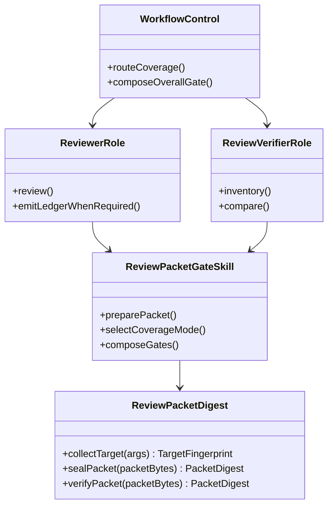

# Class and Interface Design

## N/A Usage

There is no production class hierarchy. The material interfaces are a small
Node script command contract and Markdown role/skill contracts. The diagram and
table below represent bounded function and prompt responsibilities, not an
invitation to add classes or a generic review domain model.

## Class Diagram



## Responsibility Table

| Class or interface | Source anchor | Type | Single responsibility | Forbidden responsibility | Dependencies | Lifecycle | Thread safety | Error model | Test seam |
|---|---|---|---|---|---|---|---|---|---|
| `ReviewPacketDigest.collectTarget` | new `skills/review/review-packet-gate/scripts/review-packet-digest.mjs:collectTarget` | Node function and `target` subcommand | Resolve a Git worktree or explicit artifact set and hash canonical target components plus typed paths and opaque declaration bytes. | Writing files, choosing scope, parsing ledgers/declarations, or gate decisions. | Node `child_process`, `crypto`, `fs`, `path`; Git executable only for `git-worktree`. | One process invocation, stdout result only. | No shared mutable state or cache. | Throws typed command failure; caller maps it to `NOT_READY`. | Temp Git/artifact roots: staged/unstaged overlap, deletion, mode-only, symlink, unmerged state, scoped/untracked/ignored inputs, invalid path, and digest change. |
| `ReviewPacketDigest.sealPacket` / `verifyPacket` | new `skills/review/review-packet-gate/scripts/review-packet-digest.mjs:sealPacket` | Node function and `packet` subcommand | Canonicalize LF and exactly one self-normalized `PacketDigest` field, then compute/verify SHA-256. | Parsing ledger tables or modifying packet files. | Node `crypto`, `fs`. | One input file per invocation. | No shared mutable state. | Malformed/multiple/mismatched seal is explicit failure. | Same semantic packet with LF/CRLF; changed payload; invalid or duplicate marker. |
| `ReviewPacketGateSkill` | `skills/review/review-packet-gate/SKILL.md:## Packet` | Markdown protocol contract | Define packet fields, helper invocation, mode policy, gap taxonomy, evidence, and gate meanings. | Performing a review or client-specific resume orchestration. | Helper output, frozen design, roles. | Loaded with the skill. | N/A - prompt asset. | Direct agents to `NOT_READY` when identity is unavailable. | Static source assertions and fixture references. |
| `ReviewerRole` | `agents/roles/reviewer.md:## Output Packet` | Projected specialist prompt | Produce findings-first review and conditional ledger for standard/deep mode. | Independent expected inventory, packet sealing, overall-gate decision, or edits. | Review Target Packet and local source evidence. | One delegated review. | N/A - prompt asset. | Return evidence gaps and review gate separately. | Source and all-client projection assertions. |
| `ReviewVerifierRole` | new `agents/roles/review-verifier.md` | Projected specialist prompt | Inventory expected coverage without ledger access, then compare sealed expected packet to reviewer output. | Editing, receiving reviewer output in inventory mode, redoing all correctness review, or overall-gate ownership. | Review Target Packet, sealed Expected Coverage Packet, reviewer ledger only in compare mode. | Two independent invocations or one explicitly isolated two-phase invocation. | N/A - prompt asset. | Emit named gaps, `coverage_gate`, and stale/unavailable context. | Role contract, projection, fixture-forward-evaluation checks. |
| `WorkflowControl` | `skills/workflow/workflow-control/SKILL.md:## Loop` | Markdown routing contract | Route mode, order identity/inventory/review/compare/implementation verification, and compose gates. | Reimplement role analysis or write a new scheduler. | Packet-gate skill and current workflow commands. | Per workflow invocation. | N/A - prompt asset. | Preserve separate gate outcomes. | Static routing assertions. |

## Interface Drafts

### `review-packet-digest.mjs`

```text
node <review-packet-gate-skill-root>/scripts/review-packet-digest.mjs target \
  --kind git-worktree --code-root <path> --base <commit> [--head <commit>] \
  [--untracked-scope <path>]... [--include-path <path>]... \
  --declaration <utf8-file> --json

node <review-packet-gate-skill-root>/scripts/review-packet-digest.mjs target \
  --kind artifact-set --artifact-root <path> --include-path <path>... \
  --declaration <utf8-file> --json

node <review-packet-gate-skill-root>/scripts/review-packet-digest.mjs packet \
  --input <expected-packet.md> --json
```

Every invocation resolves the script from the installed
`review-packet-gate` skill root; callers must not depend on their code-root
working directory. `git-worktree` requires a reachable Git worktree, a
resolvable base commit, and an optional head commit that defaults to `HEAD`; its
output always uses resolved full object IDs. `--untracked-scope` and
`--include-path` are repeated typed arguments. `--declaration` is a
caller-owned UTF-8 text file. The helper validates UTF-8 and LF-normalizes it,
but deliberately does not parse its records. It rejects a UTF-8 BOM, converts
CRLF/bare CR to LF, and reduces terminal LFs to exactly one. A declaration can
be a compact copy of this packet section:

```text
untracked-scope: src
untracked-scope: docs/review.md
include: generated/report.txt | generated | reviewed output
exclude: build/cache.bin | ignored | not consumed by the change
```

The command rejects duplicate, absolute, or escaping typed paths. A scope's only
permitted dot form is `.` for the target-tree root; no scopes defaults to that
root. Include paths must be Git-ignored and cannot also be tracked or selected
untracked inputs. The role contract, not the helper, checks that the opaque
declaration lists a reason for each exclusion and agrees with typed paths.
`target` returns JSON with `target_fingerprint`, component `sha256:` digests,
normalized typed path lists, `declaration_digest`, `base_revision`,
`head_revision`, `git_object_format`, and no local
worktree or artifact-root path. The packet copies the portable fields; the
coordinator records execution coordinates separately.

`artifact-set` requires one or more explicit `--include-path` values and the
same opaque declaration file. It has no Git base/head fields. The helper reads
only regular files and symlinks under the supplied artifact root; the role
contract checks inclusion/exclusion semantics. Its output has
`target_kind=artifact-set`, `base_revision=N/A`, `head_revision=N/A`, and the
same framed component/aggregate digest fields as `git-worktree`.

For both target kinds, the helper hashes binary records as follows: begin with
the ASCII bytes `review-target-v1` plus one NUL byte, then append components in
this fixed order: `committed`, `staged`, `unstaged`, `untracked`,
`declared-inputs`. Each field is `u32be(label-byte-length)`, UTF-8 label bytes,
`u64be(value-byte-length)`, and raw value bytes. Paths are sorted by UTF-8 byte
sequence. A present-path record has fields in this order: normalized path,
`present`, type, executable bit (`0` or `1`), value kind (`blob`, `worktree`,
`symlink-target`, or `gitlink-object`), and raw content/blob/object-ID bytes; a
deletion record has normalized path, `deleted`, and no value field. Component
digests are SHA-256 over their own framed records. The target digest hashes the
format version, target kind, Git object format/base/head or artifact marker,
and the five ordered component digests. Typed paths are normalized/sorted and
framed as records; the opaque declaration is only LF-normalized before hashing.
This makes content identity independent of rendered Git diff text and
local absolute paths. Every component has a `sha256:` value. For an
artifact-set, `committed`, `staged`, `unstaged`, and `untracked` each hash one
framed `not-applicable` record; only their human-readable summaries say `N/A`.
`HelperVersion` is a framed field and must increment whenever any target or
packet canonicalization rule changes.

`packet` reads UTF-8 Markdown and returns `packet_digest`. The caller puts the
returned value into the one `PacketDigest` marker before comparison. Re-running
the command verifies an existing marker. The helper never rewrites the file.

### Markdown Role Interfaces

Every review that opts into the coverage protocol contains this exact target-identity
section before scope/rule seeds. The coordinator supplies the local root only in
the separate execution-coordinates section. Inventory and comparison both rerun
the helper against that root and require every portable field below to match
before proceeding.

````text
# Review Target Packet

## Target Identity
TargetKind: <git-worktree|artifact-set>
FingerprintFormat: review-target-v1
DigestAlgorithm: sha256
HelperVersion: 1
TargetFingerprint: sha256:<digest>
GitObjectFormat: <sha1|sha256|N/A>
BaseRevision: <full-object-id|N/A>
HeadRevision: <full-object-id|N/A>

| Component | Digest | Summary |
|---|---|---|
| committed | sha256:<digest> | base/head object identities or N/A |
| staged | sha256:<digest> | index records or N/A |
| unstaged | sha256:<digest> | worktree records or N/A |
| untracked | sha256:<digest> | selected untracked scope or N/A |
| declared-inputs | sha256:<digest> | typed paths and opaque declaration bytes |

## Target Input Arguments
| Option | Value |
|---|---|
| --untracked-scope | <normalized relative path or N/A> |
| --include-path | <normalized relative path or N/A> |

## Declared Inputs
DeclarationDigest: sha256:<digest>
```text
<verbatim --declaration content>
```

## Execution Coordinates
CodeRoot: <local path or N/A>
ArtifactRoot: <local path or N/A>
DeclarationPath: <local path or N/A>
StateRoot: <local path or N/A>
ActiveChange: <change id or N/A>
````

For `git-worktree`, `declared-inputs` covers the typed untracked scope and
include paths plus the opaque declaration bytes. For `artifact-set`, it covers
the explicit include paths and declaration bytes. The packet continues
with the frozen intent, invariants, non-goals, scope seed, exclusions,
rule-source seed, discovery policy, validation evidence, known risks, and
coverage-mode sections. Quick packets use the same target identity but do not
claim independent completeness. The Target Input Arguments table lists every
repeated option sorted by option then UTF-8 value, with no duplicate rows. A
`git-worktree` with no explicit scope writes one `--untracked-scope | .` row;
an absent include path writes `--include-path | N/A`. An `artifact-set` writes
`--untracked-scope | N/A` and has at least one include-path row. Inventory and
compare construct helper options from those rows, then require the
helper-returned normalized lists and `DeclarationDigest` to match. The verbatim
payload means the code-fence body only, excluding fence lines; it uses the same
no-BOM, LF, exactly-one-final-LF normalization as the helper. `CodeRoot`/
`ArtifactRoot` are mandatory for deep inventory and compare; `DeclarationPath`
must resolve to matching normalized bytes. All execution coordinates are
excluded from portable hashes.

### Mode Compatibility

| Packet condition | Required output | Forbidden claim |
|---|---|---|
| No `coverage_mode` | Existing evidence-first findings and `review_gate` behavior only. | `coverage_gate`, coverage assurance, helper requirement, or verifier dispatch. |
| `coverage_mode=quick` | Target Identity, findings, and review gate. | Independent completeness or verifier-backed coverage. |
| `coverage_mode=standard` | Target Identity, findings, review gate, Unit Inventory, Rule Results, Observed Rule Sources, and coordinator coverage audit. | Independent deep coverage without verifier inventory/compare. |
| `coverage_mode=deep` | Target Identity, reviewer ledger, sealed Expected Coverage Packet, comparison report, and separate coverage/review/implementation/overall gates. | Continuing after target or packet identity failure. |

`review-verifier` accepts exactly one of two packet modes:

```text
inventory: Review Target Packet + target fingerprint + discovery policy
compare: sealed Expected Coverage Packet + reviewer ledger + prior finding dispositions
```

Inventory must not receive a reviewer ledger, findings, or prior comparison
result. Compare recomputes target and packet identities before matching canonical
UnitKey-plus-RuleRef tuples. Both outputs include `coverage_mode`,
`target_fingerprint`, evidence, limitations, and `coverage_gate`; neither emits
`overall_gate`.

Inventory returns one Expected Coverage Packet with this exact heading and
field/table shape. The `PacketDigest` value starts as `sha256:self`; after the
helper returns a digest, the coordinator replaces only that value and reruns the
helper to verify the seal.

```text
# Expected Coverage Packet
PacketId: <local identifier>
CoverageMode: deep
PacketDigest: sha256:self

## Target Identity
<verbatim copy of Review Target Packet Target Identity, Target Input Arguments,
Declared Inputs, and Execution Coordinates blocks>

## Rule Source Inventory
| SourceId | SourceRef | Authority | VersionRef | Availability | Disposition | EvidenceRef |
|---|---|---|---|---|---|---|

## Expected Unit Inventory
| UnitPath | AnchorKind | AnchorValue | UnitRef | Purpose | SurfaceTags | DependencyRefs | InclusionSource |
|---|---|---|---|---|---|---|---|

## Expected Rule Relations
| UnitPath | AnchorKind | AnchorValue | RuleId | RuleSourceRef | RuleVersionRef | TriggerEvidence |
|---|---|---|---|---|---|---|

## Exclusions And Unknowns
| Kind | Ref | Reason | EvidenceRef | Gate Effect |
|---|---|---|---|---|
```

The copy is required, not a link or a digest-only reference. Before sealing, the
inventory verifier reruns the helper from that copy and requires its result to
match the copied `TargetFingerprint`. The Expected Packet `PacketDigest` then
seals the copied target contract with source inventory, units, relations, and
limitations. Compare repeats the helper call from the sealed copy, requires it
to match both Expected Packet and reviewer target fingerprints, and returns
`TARGET_RECOMPUTE_UNAVAILABLE`/`NOT_READY` when any copied target block is
missing, altered, or not executable locally.

Compare returns this Coverage Verification Report. It preserves the reviewer
ledger; it does not rewrite it or produce a substitute correctness review.

```text
# Coverage Verification Report
CoverageMode: deep
TargetFingerprint: sha256:<digest>
ExpectedPacketDigest: sha256:<digest>

## Source Comparison
| RuleSourceRef | ExpectedVersionRef | ObservedVersionRef | Result | EvidenceRefs | Notes |
|---|---|---|---|---|---|

## Unit Comparison
| UnitPath | AnchorKind | AnchorValue | Result | EvidenceRefs | Notes |
|---|---|---|---|---|---|

## Rule Relation Comparison
| UnitPath | AnchorKind | AnchorValue | RuleId | RuleSourceRef | RuleVersionRef | Result | EvidenceRefs | Notes |
|---|---|---|---|---|---|---|---|

## Gap Report
| GapId | GapType | Ref | EvidenceRefs | Required Resolution |
|---|---|---|---|---|

## Coverage Gate
coverage_gate: <READY|READY_WITH_NOTES|NOT_READY|NEEDS_USER_DECISION>
assurance: independent-deep
```

## Rejected Alternatives

| Alternative class/interface shape | Why rejected | Tradeoff kept |
|---|---|---|
| `ReviewLedger` parser, AST, and persistent model. | The frozen V1 boundary rejects a serialized schema/parser and semantic decisions remain agent work. | The digest helper only canonicalizes typed paths and opaque declaration bytes. |
| A generic `ReviewSession` object spanning inventory and compare. | It would encourage hidden in-memory context and same-agent resume dependency. | Immutable packet files carry all cross-phase state. |
| A verifier subclass of `ReviewerRole`. | Inheritance suggests shared correctness/coverage authority that the protocol must separate. | Separate projected prompt with a compact packet interface. |
