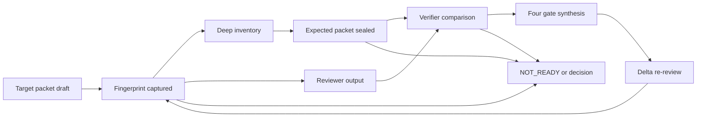

# Runtime Flow

## N/A Usage

Lifecycle and failure behavior are material because phase-1 inventory must be
sealed before the ledger exists, comparison must detect stale inputs, and a
workflow can preserve a coverage result while later implementation verification
fails.

## Object Lifecycle



## Main Sequence

```mermaid
sequenceDiagram
  participant C as Coordinator
  participant H as Digest helper
  participant V as Review verifier
  participant R as Reviewer
  participant W as Workflow control

  alt coverage_mode absent
    C->>R: existing review packet
    R-->>W: findings and review gate
    W-->>C: legacy review; no coverage gate
  else explicit coverage mode
    C->>H: target(kind, root, base/head, typed paths, declaration)
    H-->>C: portable target fingerprint or failure
    alt quick
      C->>R: packet with quick target identity
      R-->>W: findings and review gate
      W-->>C: no independent coverage claim
    else standard
      C->>R: packet with standard target identity
      R-->>W: findings plus ledger and review gate
      W-->>C: coordinator coverage audit
    else deep
      C->>V: inventory packet only
      V-->>C: Expected Coverage Packet
      C->>H: packet(Expected Coverage Packet)
      H-->>C: sealed packet digest
      C->>R: packet with same target fingerprint
      R-->>C: findings, ledger, review gate
      C->>V: compare(sealed packet, ledger, dispositions)
      V-->>W: gaps, evidence, coverage gate
      W-->>C: separate coverage, review, implementation, overall gates
    end
  end
```

## Failure and Rollback Sequence

```mermaid
sequenceDiagram
  participant C as Coordinator
  participant H as Digest helper
  participant V as Review verifier
  participant W as Workflow control

  C->>H: target or packet verification
  alt Git/input/seal failure
    H-->>C: explicit failure reason
    C->>W: do not dispatch or continue deep comparison
    W-->>C: coverage_gate=NOT_READY
  else target or seal changed
    H-->>V: mismatch evidence
    V-->>W: STALE_REVIEW
    W-->>C: coverage_gate=NOT_READY; re-inventory required
  else required source unavailable
    V-->>W: RULE_SOURCE_GAP or NEEDS_CONTEXT
    W-->>C: no unqualified READY
  else implementation verification fails later
    W-->>C: preserve coverage evidence; implementation_verification_gate and overall_gate=NOT_READY
  end
```

## State Transitions

| State | Entered by | Exits to | Invariants |
|---|---|---|---|
| `legacy-review` | `coverage_mode` absent. | `overall-pending`, `blocked`. | Existing review behavior remains valid; no coverage gate or assurance claim is emitted. |
| `unbound` | Review request has no verified target. | `fingerprinted`, `blocked`. | No deep inventory, reviewer ledger comparison, or coverage-ready claim. |
| `fingerprinted` | Helper returns all required target components. | `inventory-pending`, `review-pending`, `stale`, `blocked`. | Portable fingerprint, not execution coordinates, identifies review target; deep phases retain an accessible local root for recomputation. |
| `inventory-pending` | Deep mode chosen after target verification. | `expected-packet-draft`, `blocked`. | Verifier receives no reviewer ledger or findings. |
| `expected-packet-draft` | Inventory returns copied target identity plus expected sources, units, relations, and limitations. | `sealed`, `blocked`. | Packet is not comparable until identity recomputes from the copy and one valid self-normalized digest exists. |
| `sealed` | Helper verifies Expected Coverage Packet digest. | `compare-pending`, `stale`. | Packet content and fingerprint cannot change silently. |
| `review-pending` | Reviewer receives packet at standard/deep mode. | `reviewed`, `stale`, `blocked`. | Reviewer emits findings-first output; coverage ledger is conditional. |
| `reviewed` | Reviewer returns ledger and review gate. | `compare-pending`, `overall-pending`. | Findings and coverage facts remain distinct. |
| `compare-pending` | Matching sealed packet and ledger are available. | `coverage-decided`, `stale`, `blocked`. | Verifier rechecks identities before relation matching. |
| `coverage-decided` | Verifier emits gaps and coverage gate. | `overall-pending`, `re-review`. | `coverage_gate` does not override `review_gate`. |
| `overall-pending` | Required coverage/review/implementation evidence available. | `ready`, `blocked`, `re-review`. | Coordinator alone composes `overall_gate`. |
| `stale` | Target, packet, rule version, unit identity, or material dependency differs. | `fingerprinted`, `blocked`. | Prior rows cannot be silently carried forward. |

## Traceability

| Flow or state | Requirement / source fact | Source anchor | Verification plan |
|---|---|---|---|
| Target capture | Portable review target and uncommitted-input requirements. | `specs/review-coverage.md:Requirement: Portable Review Target` | Helper tests modify Git components, scope selection, declared input, and artifact-set content, then assert digest changes. |
| Inventory isolation | Expected packet must precede reviewer output. | `design.md:## Review Verifier Algorithm` | Role text, fixture-forward-evaluation input, and recorded evidence ensure no ledger appears in inventory packet. |
| Packet sealing | Expected packet digest mismatch must stop comparison. | `specs/review-coverage.md:Requirement: Portable Two-Phase Verification` | Helper tests cover matching, changed, duplicate, and malformed markers; fixture verifies copied target identity is present. |
| Conditional reviewer output | Explicit modes add only their required output; legacy review remains valid. | `proposal.md:## Compatibility` | Source assertions include no-mode, quick, standard, and deep routing/output requirements. |
| Four-gate synthesis | Coverage and correctness/implementation gates remain separate. | `specs/review-coverage.md:Requirement: Separate Gate Decisions` | Routing text and fixture scenario assert stated combinations. |
| Delta re-review | Changed identity invalidates affected evidence. | `specs/review-coverage.md:Requirement: Delta Re-Review` | Helper stale target test and forward evaluation record. |
