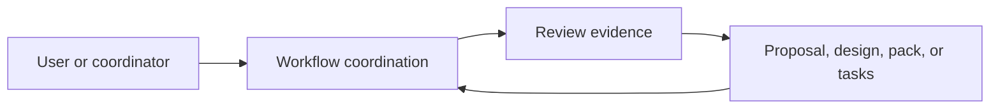
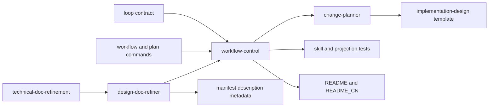

# Code Topology

## Subsystem Topology

Use this section for capability or runtime boundaries: inputs, outputs,
lifecycle, external dependencies, and failure boundaries.

## Module Topology

Use this section for code organization boundaries: directories, packages,
modules, and dependency direction.

## Dependency Rules

| Rule | Allowed | Forbidden | Rationale |
|---|---|---|---|
| Coordination to workspace | Skills and commands tell the agent what to read and when to stop. | Inferring readiness from file presence or command success. | Semantic readiness requires reading. |
| Planner to upstream design | Slices reference the accepted design or reviewed pack. | Settle architecture inside a slice or omit a required pack. | Prevents design during implementation. |
| Canonical to projection | Project source through `harness-project`; synchronize changed skill descriptions in manifest metadata. | Directly edit `.agents/` or `.codex/`, or change asset routes. | Preserves package ownership and routing consistency. |
| Core scope | Generic artifacts and diagnostics. | Product facts, tracker rules, or review-verifier V2 changes. | Maintains Core generality. |
| Existing tooling | Reuse current document writers and structural validators. | New gate schema, phase state, digest protocol, or command. | The problem is workflow clarity, not missing machinery. |

## Source Anchors

Use `relative/path:Symbol` when possible. For symbol-less config or docs, use
`relative/path` plus the smallest stable heading, key, or field name.

| Boundary | Source anchor | Notes |
|---|---|---|
| Coordinator loop | `skills/workflow/workflow-control/SKILL.md:Loop` | Put solution-design review before trigger assessment. |
| Planning admission | `skills/change/change-planner/SKILL.md:Planning Flow` | Refuse slicing while upstream design remains unresolved. |
| Design refinement | `skills/knowledge/design-doc-refiner/SKILL.md:Workflow` | Settle solution design before topology mapping. |
| Refiner output contract | `skills/knowledge/design-doc-refiner/references/output-contract.md` | Solution-design refinement outputs the design, ambiguities, and validation intent; formal task slicing belongs to `change-planner` after topology assessment. |
| Adjacent writing route | `skills/knowledge/technical-doc-refinement/SKILL.md:Boundary` | Route implementation task breakdown to `change-planner`, not solution refinement. |
| Skill metadata | `harness.manifest.json` entry for `design-doc-refiner` | Keep description equal to the canonical skill front matter; do not change routes or client support. |
| Operator guidance | `skills/change/change-workspace-operator/SKILL.md:Example Flows` | Explain ordering and structural-only writers. |
| User commands | `commands/harness/workflow.md`, `commands/harness/plan.md` | Route the same phase order at entry points. |
| Generic loop | `rules/loop-contract.md` | Add solution and conditional topology gates. |
| Pack template | `templates/changes/implementation-design/README.md` | State that the pack follows a settled solution and requires review before slicing. |
| Regression coverage | `tests/test-skills.js`, `tests/test-projection.js` | Verify skill body, refiner reference contract, metadata, canonical wording, and client delivery. |
| User guidance | `README.md`, `README_CN.md` | Explain staged and lightweight paths. |
