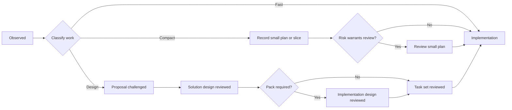
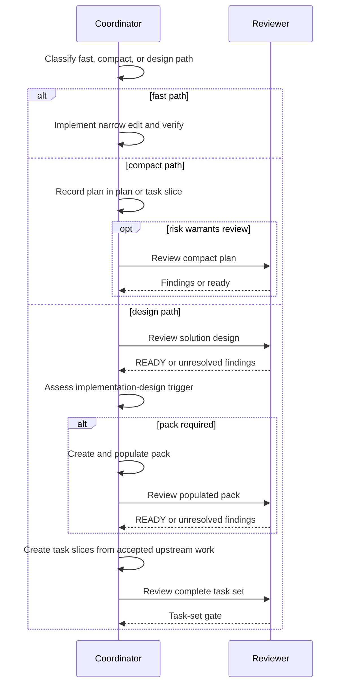
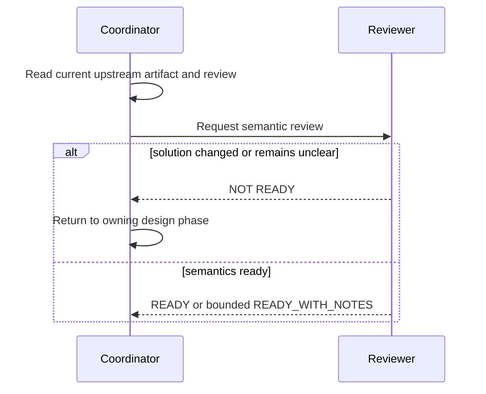

# Runtime Flow

## N/A Usage

If lifecycle, sequence, state, failure, rollback, concurrency, migration, and
idempotency behavior are not material to this change, write `N/A - <reason>`
under the sections below instead of leaving diagrams or tables blank.

## Object Lifecycle

## Main Sequence

## Failure and Rollback Sequence

## State Transitions

N/A - these are workflow decisions made during an agent run, not persisted
runtime states. The flow diagrams describe ordering only.

## Traceability

| Flow or state | Requirement / source fact | Source anchor | Verification plan |
|---|---|---|---|
| Solution design precedes trigger | Accepted phase order | `design.md:Paths Through The Workflow` | Skill and command tests. |
| Required pack precedes slicing | Trigger and task rules | `design.md:Implementation-Design Trigger`, `Task-Slicing Gate` | Planner, template, and workflow tests. |
| Reopened upstream stops progress | Review and transition rules | `design.md:Review And Transition Rules` | Skill wording and reviewer scenarios. |
| Lightweight paths remain | Compatibility requirement | `design.md:Fast Path`, `Compact Path` | Explicit fast/compact wording tests. |
| Existing tools remain structural | Current source fact | `research.md:Confirmed Current-State Facts` | Diff review confirms no writer, validator, schema, new command, command route, or capability change; existing workflow/plan command text may change. |
