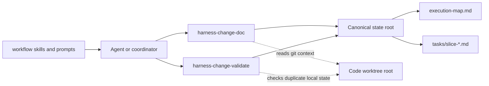
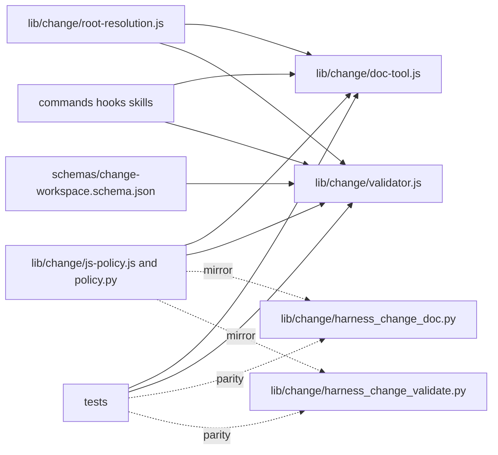

# Code Topology

## Subsystem Topology

## Module Topology

## Dependency Rules

| Rule | Allowed | Forbidden | Rationale |
|---|---|---|---|
| Root resolution is shared by JS change tools. | Add `lib/change/root-resolution.js` and import it from doc and validator tools. | Duplicate root inference in each command. | The bug class comes from inconsistent implicit roots. |
| `--repo-root` remains backward compatible. | Treat `--repo-root` as the state root unless `--state-root` is explicitly provided. | Redefining `--repo-root` as code root. | Existing scripts and docs depend on current semantics. |
| Execution-map policy lives in change policy/schema. | Add `execution-map` to JS/Python policy and schema allowed files. | Ad hoc unregistered top-level Markdown. | Validators and indexes must understand the artifact. |
| Execution-map integration is complete, not advisory. | Update artifact registry, schema allowlist, strict-layout behavior, inventory/index output, status output, and top-level file budget together. | A Markdown file that validators merely tolerate. | The scheduling artifact must be visible to both humans and tooling. |
| `assign-slice` writes only the map. | Update `execution-map.md` and do not mutate task-slice body except through later explicit commands. | Mirroring the same assignment state into each task slice. | Prevents drift between global scheduling and slice evidence. |
| Validator reads slice evidence but does not synthesize it. | Check evidence pointer presence and path existence when possible. | Inventing validation state from git status or branch names. | Evidence must be explicit and reviewable. |
| Stacked topology delegates git semantics to `stacked-branch-workflow`. | Reference dependency and parent rules in skills/prompts. | Reimplementing rebase/force-push workflow inside change tools. | Core change tools should validate planning state, not mutate refs. |
| Python mirror follows supported JS behavior. | Update Python policy, schema lookup, command parsing, execution-map commands, and worktree validation when public CLI behavior changes. | Letting JS and Python command contracts drift silently or relying on undocumented unsupported paths. | Existing tests already expect parity for several change-tool paths. |

## Source Anchors

Use `relative/path:Symbol` when possible. For symbol-less config or docs, use
`relative/path` plus the smallest stable heading, key, or field name.

| Boundary | Source anchor | Notes |
|---|---|---|
| JS doc command entry | `lib/change/doc-tool.js:runChangeDoc` | Add root resolution and dispatch for `resolve`, `execution-map`, and `assign-slice`. |
| JS change directory helper | `lib/change/doc-tool.js:changeDir` | Replace direct path joins at call sites with resolved state-root context where needed. |
| JS validator entry | `lib/change/validator.js:runChangeValidate` | Add `--state-root`, optional `--code-root`, and `--worktrees` validation. |
| JS status report | `lib/change/validator.js:buildStatusReport` | Surface execution-map presence and worktree-validation summaries when requested. |
| JS policy | `lib/change/js-policy.js:ARTIFACTS` | Add `execution-map` artifact and command names. |
| Python policy | `lib/change/policy.py:ARTIFACTS` | Mirror artifact policy. |
| Python doc command parser | `lib/change/harness_change_doc.py:build_parser` | Mirror public command flags or intentionally defer with tests. |
| Python validator parser | `lib/change/harness_change_validate.py:main` | Mirror root flags, repo-local schema precedence, status report fields, and worktree validation. |
| Change schema | `schemas/change-workspace.schema.json:layout.allowed_files_by_mode` | Allow `execution-map.md` for structured workspaces and adjust top-level limits if required. |
| Workflow prompt | `commands/harness/workflow.md:Required Behavior` | Require resolving state root and code root before planning/writes. |
| Handoff prompt | `commands/harness/handoff.md:Required Behavior` | Include execution-map state when present. |
| Session bootstrap hook | `hooks/intents/session-bootstrap.md:Active change resolution` | Mention state root and code root ambiguity. |
| Change workspace skill | `skills/change/change-workspace-operator/SKILL.md:Commands` | Document new commands and root options. |
| Change planner skill | `skills/change/change-planner/SKILL.md:Slice Rules` | Document assignment through execution map for multi-worktree slices. |
| Stack workflow skill | `skills/workflow/stacked-branch-workflow/SKILL.md:Stack Invariants` | Reference for `topology=stacked`. |
| Tool tests | `tests/test-change-tools.js` | Add root-resolution, execution-map, assign-slice, and validator cases. |
| Skill/hook tests | `tests/test-skills.js`, `tests/test-subagents-hooks.js` | Protect prompt and skill wording. |
