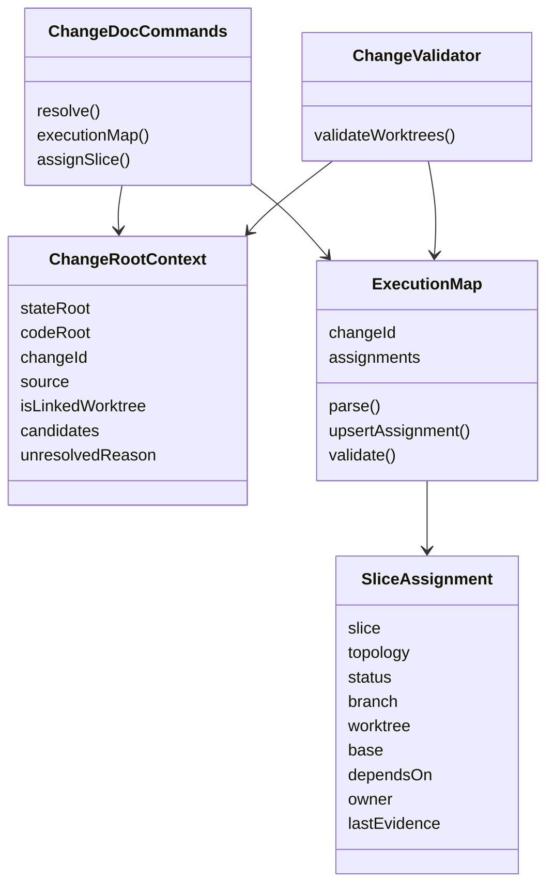

# Class and Interface Design

## N/A Usage

This is a JavaScript/Python CLI tooling change, so "class" means bounded helper
structure or command interface rather than an object-oriented class hierarchy.

## Class Diagram



## Responsibility Table

| Class or interface | Source anchor | Type | Single responsibility | Forbidden responsibility | Dependencies | Lifecycle | Thread safety | Error model | Test seam |
|---|---|---|---|---|---|---|---|---|---|
| `ChangeRootContext` | `lib/change/root-resolution.js` | New JS helper value | Represent resolved state root, code root, active change, candidate roots, and unresolved reason. | Writing files, selecting an ambiguous state root, mutating git refs. | `node:path`, `node:fs`, optional git probing through child process. | Created per command invocation. | CLI process local; no shared mutable state. | Returns unresolved context or throws command errors for invalid explicit roots. | Unit tests with temp directories and stubbed/git-backed worktree layouts. |
| `resolveChangeContext(args, options)` | `lib/change/root-resolution.js` | New JS helper function | Apply root precedence and fail-fast rules consistently. | Parsing execution-map rows or validating slice states. | CLI args, env, cwd, optional change id. | Called before doc/validator command dispatch. | Pure except filesystem/git probes. | Ambiguous or missing state root blocks regulated writes. | Direct tests plus doc/validator command tests. |
| `ExecutionMap` helpers | `lib/change/doc-tool.js` or focused helper if complexity warrants | New helper functions | Parse, render, and upsert the execution map table while preserving front matter. | Editing task-slice validation content or git branches. | Markdown table helpers, policy artifact registry. | Loaded and written during map commands. | Single CLI process. | Invalid columns or duplicate slices produce command errors. | Assign-slice tests inspect Markdown and JSON output. |
| `SliceAssignment` row | `execution-map.md` table | Data contract | One row binding a task slice to execution status and root/branch metadata. | Holding detailed implementation steps. | `tasks/slice-*.md` for slice identity and evidence pointers. | Created by `assign-slice`, updated as status changes. | N/A for file data. | Invalid status/topology/dependency rejected or warned by validator. | Validator tests with temp change workspaces. |
| `assign-slice` command | `lib/change/doc-tool.js:runChangeDoc` | CLI command | Create/update one execution-map assignment row. | Creating git worktrees, checking out branches, or changing task-slice bodies. | Root resolver, execution-map helpers. | Explicit user/coordinator command. | CLI process local. | Missing slice, duplicate active worktree, invalid topology/status return nonzero. | Command tests. |
| `--worktrees` validation mode | `lib/change/validator.js:runChangeValidate` | CLI flag | Validate execution-map consistency and duplicate local state hazards. | Resolving merge correctness from git history. | Root resolver, execution map parser, filesystem checks. | Optional validation pass. | CLI process local. | Errors for broken invariants; warnings for transition gaps. | Validator tests. |
| Python mirror commands | `lib/change/harness_change_doc.py`, `lib/change/harness_change_validate.py` | CLI parity surface | Keep documented V1 behavior aligned with JS commands. | Diverging silently from JS commands or deferring public parity without reopening scope. | `policy.py`, Python parser. | CLI process. | CLI process local. | Same user-facing error classes as JS for documented behavior. | Existing Python parity tests extended. |

## Interface Drafts

Command additions:

```text
harness-change-doc [--state-root <state-root> | --repo-root <state-root>] [--code-root <code-root>] resolve [--change <change>] --json
harness-change-doc [--state-root <state-root> | --repo-root <state-root>] [--code-root <code-root>] execution-map <change> --json
harness-change-doc [--state-root <state-root> | --repo-root <state-root>] [--code-root <code-root>] assign-slice <change> --slice <slice-file-or-id> [--branch <branch>] [--worktree <path>] [--base <base>] [--depends-on <csv>] [--topology parallel|stacked|standalone] [--owner <owner>] [--status planned|claimed|active|ready|merged|blocked|superseded] [--last-evidence <evidence-ref>]
harness-change-validate [--state-root <state-root> | --repo-root <state-root>] [--code-root <code-root>] --change <change> [--worktrees] [--json]
```

Root option semantics:

- `--state-root` is the clear canonical state-root option.
- `--repo-root` remains a backward-compatible alias for state root.
- `--code-root` is optional and identifies the source/worktree root for
  duplicate-state checks and resolve output.
- When both `--state-root` and `--repo-root` are present and differ, the command
  fails instead of choosing one.
- The canonical documented form places root options before the command so the JS
  and Python command lines can share one contract. Implementations may continue
  accepting existing option order where current parsers already do so.

Execution-map artifact contract:

- File: `execution-map.md` at the top level of the canonical change workspace.
- Front matter:

  ```yaml
  artifact: execution-map
  status: draft
  tags: [execution-map]
  description: "Slice-to-worktree execution map."
  ```

- Allowed file statuses: `draft`, `reviewed`, `frozen`, `superseded`.
- Policy/schema integration must add `execution-map` to the JS and Python
  artifact registries, structured-workspace allowlist, strict-layout rules,
  inventory/index output, and status output. If the existing structured top-level
  file budget would reject a valid workspace containing `execution-map.md`, that
  budget must be raised in the same slice.
- `harness-change-validate --status --json` should report whether the execution
  map exists, how many assignment rows are active, and whether `--worktrees`
  checks were requested.
- `harness-change-doc execution-map <change> --json` is read-only. When the map
  is absent, it succeeds with `exists: false`, `assignments: []`, and the
  resolved root context instead of creating the artifact or failing ordinary
  single-root work.

Execution-map columns:

```markdown
| Slice | Topology | Status | Branch | Worktree | Base | Depends On | Owner | Last Evidence |
|---|---|---|---|---|---|---|---|---|
```

Allowed topology values:

- `parallel`: independent sibling slice; `Depends On` should be empty or `none`.
- `stacked`: depends on one or more lower slices or an explicit parent branch.
- `standalone`: one assigned worktree for a non-parallel change; useful when the
  map is used only to protect linked worktree state.

Allowed row statuses:

- `planned`, `claimed`, `active`, `blocked`, `ready`, `merged`, `superseded`.

Status-driven field rules:

- `planned` may omit `Branch` and `Worktree`; it represents a future slice
  reservation. `assign-slice --status planned` is allowed only with an existing
  task slice and must not imply that a worktree exists.
- `claimed`, `active`, `blocked`, and `ready` require `Branch` and `Worktree`.
- `ready`, `merged`, `blocked`, and `superseded` require `Last Evidence`.
- `merged` and `superseded` may retain historical branch/worktree values, but
  they are terminal for active worktree uniqueness checks.

Evidence reference contract:

- `Last Evidence` is a change-relative reference to a durable artifact in the
  canonical `.changes/<change>` workspace.
- Allowed forms are:
  - `path/to/artifact.md`
  - `path/to/artifact.md#heading-slug`
- The path portion must be relative to the change workspace root, must not be
  absolute, and must not escape through `..`.
- Markdown heading fragments use the same lowercase, punctuation-stripped,
  hyphen-joined slug convention used by common Markdown renderers.
- Validator behavior:
  - blank `Last Evidence` is an error for gated statuses;
  - missing or escaping paths are errors;
  - a fragment on a non-Markdown file is an error;
  - a fragment that does not match a heading in an existing Markdown file is an
    error;
  - paths without fragments are valid when the file exists.
- External URLs, commit hashes, and free-text notes belong inside the referenced
  artifact, not directly in the map. This keeps the map stable and keeps
  evidence reviewable inside the canonical workspace.

Worktree path semantics:

- `--worktree` accepts absolute or relative paths.
- Relative paths resolve against explicit `--code-root` when present; otherwise
  they resolve against the command cwd.
- The `Worktree` column is a local execution coordinate, not a portable branch
  identity. Branch, base, dependencies, and evidence references carry the
  portable scheduling meaning.
- Existing paths are persisted as normalized absolute paths and compared by real
  path so symlinked aliases do not create duplicate active assignments.
- Missing paths are persisted as normalized absolute paths after resolving the
  configured base and are validated by severity: warning for `planned`,
  `claimed`, or `blocked`; error for `active` or `ready`; no liveness error for
  `merged` or `superseded`.
- Cross-machine or cross-checkout handoff treats `Worktree` as advisory until a
  coordinator reassigns the row with `assign-slice`; validators must not treat a
  stale absolute path as branch truth.
- Unreadable or non-git paths are warnings for `claimed` or `blocked`, errors
  for `active` or `ready`, and ignored for liveness after `merged` or
  `superseded`. Duplicate `.changes/<change>` state is an error for
  non-terminal execution rows when the duplicate is not the canonical state
  root; terminal rows downgrade that report to a warning.

Python parity decision:

- V1 requires full public parity between JS and Python change tools for
  `execution-map` policy, root flags, `resolve`, `execution-map --json`,
  `assign-slice`, `--worktrees`, repo-local schema precedence, and status output.
- A Python command may reject only implementation-internal helper options that
  are not documented here; documented commands must not silently diverge.

## Rejected Alternatives

| Alternative class/interface shape | Why rejected | Tradeoff kept |
|---|---|---|
| Add assignment metadata only to task-slice front matter. | The current front matter policy is artifact-level and does not support rich scheduling state; scanning all slices would make coordination harder. | Task slices retain detailed validation and handoff evidence. |
| Use JSON for execution-map V1. | Markdown is consistent with existing `.changes` artifacts and can be reviewed by agents/humans. | The table is constrained enough for parser validation. |
| Create a broad worktree manager command that runs `git worktree add`. | This change is about workflow state, not git worktree lifecycle management. | Root resolver can read git/worktree facts without mutating refs. |
| Make `--repo-root` mean code root. | It would break existing commands and examples. | Add `--state-root` as a clearer alias while preserving compatibility. |
