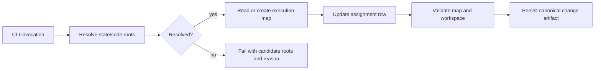
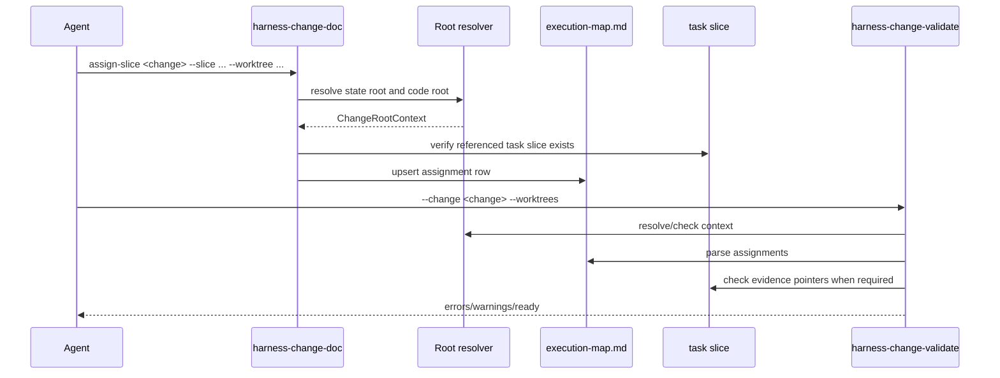

# Runtime Flow

## N/A Usage

Runtime flow is material because the design changes how commands decide where to
write durable workflow state.

## Object Lifecycle



## Main Sequence



## Failure and Rollback Sequence

```mermaid
sequenceDiagram
  participant A as Agent
  participant D as harness-change-doc
  participant R as Root resolver
  participant M as execution-map.md

  A->>D: assign-slice from linked worktree without explicit state root
  D->>R: resolve roots
  R-->>D: unresolved with candidate roots
  D-->>A: nonzero exit; no file write
  A->>D: retry with --state-root <canonical>
  D->>M: write assignment
  A->>D: assign-slice --status superseded or restore prior row
```

## State Transitions

| State | Entered by | Exits to | Invariants |
|---|---|---|---|
| `planned` | Initial map row or coordinator reserves a future slice without an active worktree. | `claimed`, `superseded` | Slice exists; branch/worktree may be blank only in this state. |
| `claimed` | `assign-slice` records owner, branch, and worktree before edits begin. | `active`, `blocked`, `superseded` | Slice, owner, branch, and worktree are present; worktree path is unique among non-terminal rows. |
| `active` | Worker confirms the assigned worktree is being used for the slice. | `blocked`, `ready`, `superseded` | No duplicate `.changes/<change>` is allowed under the assigned worktree unless it is the canonical state root. |
| `blocked` | Worker records a blocker with owner or decision needed. | `claimed`, `active`, `superseded` | `Last Evidence` is a valid change-relative reference to a task-slice section, review, or decision describing the blocker. |
| `ready` | Worker finishes the slice and records validation evidence. | `merged`, `active`, `blocked`, `superseded` | `Last Evidence` is a valid change-relative reference to validation/review evidence; dependencies are not blocked. For `stacked`, dependencies are `ready` or `merged`. |
| `merged` | Coordinator records merge/rebase evidence after integration. | `superseded` | `Last Evidence` is a valid change-relative reference to merge or handoff evidence; `stacked` dependencies are already `merged`; no active worktree uniqueness check is needed. |
| `superseded` | Coordinator replaces or cancels the assignment. | N/A | Row is terminal; reason appears in `Last Evidence`. |

Allowed transitions are intentionally monotonic except for `ready -> active` or
`ready -> blocked`, which covers re-review or validation reversal.

## Root Resolution Precedence

1. If `--state-root` is provided, use it as the canonical state root. If
   `--repo-root` is also provided and resolves differently, fail.
2. Else if `--repo-root` is provided, use it as the canonical state root for
   backward compatibility.
3. Else if `HARNESS_CHANGE_STATE_ROOT` is set, use it as the canonical state
   root and mark the source as environment.
4. Else gather the current code root from explicit `--code-root`, git root, or
   cwd, and collect candidate state roots from cwd-under-`.changes`, the current
   worktree, known git worktrees, and existing `.changes/<change>` locations
   that can be discovered without mutating the repository. If cwd is inside
   `.changes/<change>` and no `--change` was provided, derive the active change
   id from the path, but do not select that state root yet.
5. If more than one non-explicit candidate contains `.changes/<change>`, return
   unresolved and block regulated writes. This check runs before accepting a
   cwd-derived or linked-worktree-local `.changes/<change>` as canonical.
6. If exactly one candidate containing `.changes/<change>` remains and it is
   derived from cwd-under-`.changes` or the current repo root, use it as the
   inferred state root.
7. Else if the only candidate is another worktree's state root, return
   unresolved with that candidate and require explicit `--state-root`.
8. Else if cwd appears to be a linked worktree, return unresolved with candidate
   roots from known worktrees; do not write.
9. Else use cwd/repository root only for read-only resolve output; regulated
   writes require the target change to exist.

## Fail-Fast Conditions

- Regulated writes fail when state root is unresolved.
- Regulated writes fail when explicit `--state-root` and `--repo-root` disagree.
- `assign-slice` fails when the target slice file does not exist.
- `assign-slice` fails when `topology=parallel` includes dependencies other
  than blank or `none`.
- `assign-slice` fails when `topology=stacked` has neither `Depends On` nor
  `Base`.
- `assign-slice` fails when a non-`planned` row lacks a required `Branch` or
  `Worktree`.
- Worktree validation errors when a gated status has blank, missing, escaping,
  or invalid-fragment `Last Evidence`.
- Worktree validation errors when a `stacked` row references an unknown
  dependency, dependency cycle, or a dependency whose status is not compatible
  with the row status.
- Worktree validation errors when two non-terminal rows use the same worktree.
- Worktree validation follows the severity table when an assigned worktree
  contains `.changes/<same-change>` and that path is not the canonical state
  root: non-terminal execution rows are errors; terminal rows are warnings.

## Dependency Status Rules

| Topology | Row status | Dependency rule |
|---|---|---|
| `parallel` | Any | `Depends On` is blank or `none`; any other value is an error. |
| `standalone` | Any | `Depends On` is blank or `none`; `Base` is informational only. |
| `stacked` | `planned`, `claimed`, `active`, `blocked` | Dependencies must exist in the map and must not form a cycle. |
| `stacked` | `ready` | Every dependency is `ready` or `merged`; `blocked`, `active`, `claimed`, `planned`, or `superseded` dependencies are errors. |
| `stacked` | `merged` | Every dependency is `merged`; any other dependency status is an error. |
| `stacked` | `superseded` | Dependencies are checked for existence and cycles only. |

## Worktree Validation Severity

| Row status | Missing path | Unreadable or non-git path | Duplicate `.changes/<change>` under assigned worktree |
|---|---|---|---|
| `planned` | WARN when a path is present | WARN when a path is present | WARN |
| `claimed` | WARN | WARN | ERROR |
| `active` | ERROR | ERROR | ERROR |
| `blocked` | WARN | WARN | ERROR |
| `ready` | ERROR | ERROR | ERROR |
| `merged` | ignored for liveness | ignored for liveness | WARN |
| `superseded` | ignored for liveness | ignored for liveness | WARN |

## Traceability

| Flow or state | Requirement / source fact | Source anchor | Verification plan |
|---|---|---|---|
| Root resolution before writes | Distinguish code root from state root and reject duplicate non-explicit candidates. | `requirements.md` Accepted Requirements; `reviews/subagent-design-r01.md` WWP-SUB-R01-F01 | Unit tests for explicit, env, cwd-under-change, duplicate linked candidates, linked unresolved, and conflicting roots. |
| Execution-map assignment | Multi-worktree work needs explicit slice-to-worktree assignment. | `proposal.md` What Changes | Command tests for creating/updating map rows. |
| Status evidence | `ready`, `merged`, and `blocked` require canonical evidence. | `reviews/draft-r01.md` WWP-R01-F03; `reviews/implementation-design-r02.md` WWP-R02-F05 | Validator tests for blank, missing, escaping, valid path, valid heading, and missing-heading `Last Evidence`. |
| Parallel topology | Independent sibling slices must not be treated as branch stacks. | `reviews/draft-r01.md` WWP-R01-F04 | Validator tests for `parallel` with and without dependencies. |
| Stacked topology | Use existing stack invariants for dependent branches. | `skills/workflow/stacked-branch-workflow/SKILL.md` Stack Invariants | Skill/prompt tests mention stack workflow for `topology=stacked`. |
